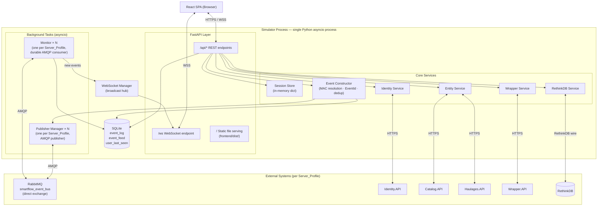
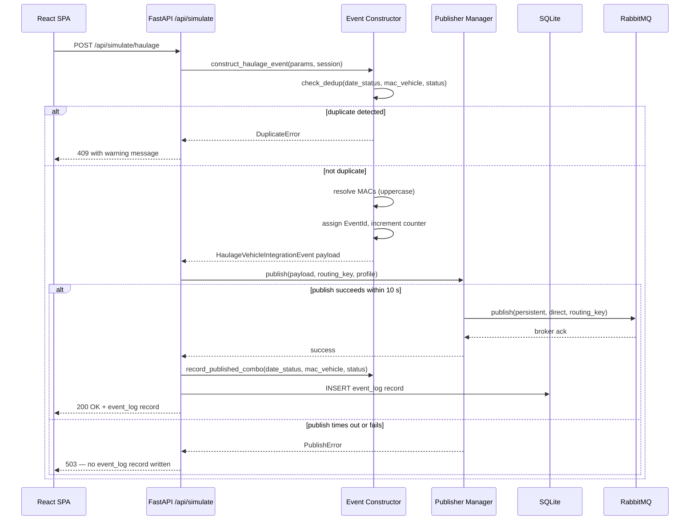
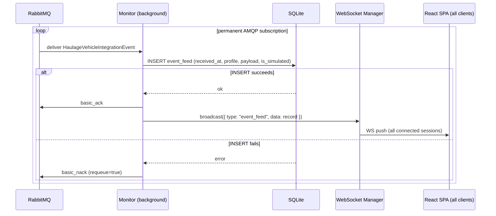

# Design Document: Haulage Event Simulator

## Overview

The Haulage Event Simulator is a standalone web application that fills the gap
left by external hardware (reader/WiFi edge gateways) in test and staging
environments. It generates and publishes well-formed SmartFlow integration
events — primarily `HaulageVehicleIntegrationEvent` — onto the same RabbitMQ
exchange that `Haulages.API` consumes in production, enabling operators to drive a
complete `Load → WeighingMachine → Unload` haulage cycle without physical hardware.

The application runs as a **single Python process** on a Linux server. A compiled
React SPA is served as static files from the same HTTP process, so no additional
web server is needed. A permanent background **Monitor** component subscribes to the
event bus 24/7, independent of any active user session, so events emitted by real
hardware are always captured for post-login review.

The system exposes three interface styles to the browser: a **REST API** for
request/response actions (auth, entity loading, event publication), a **WebSocket**
channel for real-time push updates (new feed events, connection-status changes), and
**static file serving** for the compiled SPA bundle.

---

## Architecture

### High-Level Component Diagram



### Event Publication Sequence



### Monitor Consumer Sequence



### Key Design Decisions

| Decision | Choice | Rationale |
|----------|--------|-----------|
| Process model | Single Python asyncio process | Meets Req 17.1 (no Docker); asyncio handles concurrent sessions and background tasks efficiently |
| RabbitMQ client | `aio-pika` | Native asyncio; supports consumer and publisher in separate connections |
| HTTP client | `httpx` (async) | Native asyncio; connection pooling per profile |
| Local database | SQLite via `aiosqlite` + raw SQL | No separate process; sufficient for a single-instance audit tool |
| Auth | Simulator session token (server-side) | Bearer_Token stays server-side per Req 18.5; simulator issues its own opaque session token |
| Monitor topology | One Monitor + one Publisher per Server_Profile, all started at startup | All configured profiles capture events 24/7 (Req 13.1, 17.3) |
| Monitor queue name | `smartflow_simulator_{sanitized_profile_name}` (durable) | Profile-scoped queue prevents cross-profile confusion; durable survives broker restart |
| Config format | YAML | Human-editable, no special tooling required |
| Frontend bundler | Vite + React | Fast build, served as static files from the FastAPI process |
| State management | Zustand | Lightweight, no boilerplate, fits the single-page tool model |

---

## Components and Interfaces

### Project Structure

```
haulage-event-simulator/
├── backend/
│   ├── app/
│   │   ├── main.py                     # FastAPI app factory, lifespan, mounts
│   │   ├── config.py                   # YAML config loading and ServerProfile models
│   │   ├── database.py                 # aiosqlite setup, schema migration
│   │   ├── session_store.py            # In-memory SessionData dict + helpers
│   │   ├── api/
│   │   │   ├── auth.py                 # POST /api/auth/login · /logout
│   │   │   ├── profiles.py             # GET /api/profiles
│   │   │   ├── entities.py             # GET /api/entities · POST /api/entities/reload
│   │   │   ├── simulate.py             # POST /api/simulate/*
│   │   │   ├── history.py              # GET /api/history/logs · /feed
│   │   │   └── summary.py             # GET /api/summary
│   │   ├── services/
│   │   │   ├── identity_service.py     # SmartFlow token endpoint
│   │   │   ├── entity_service.py       # Catalog + Haulages entity fetching + filtering
│   │   │   ├── event_constructor.py    # Payload building, MAC resolution, EventId, dedup
│   │   │   ├── rethinkdb_service.py    # Weight writes for Standard weighing mode
│   │   │   └── wrapper_service.py      # HTTP POST to Wrapper.API /api/v1/Location/
│   │   ├── background/
│   │   │   ├── monitor.py              # AMQP consumer per profile with reconnect
│   │   │   └── publisher_manager.py    # AMQP publisher per profile with reconnect
│   │   ├── models/
│   │   │   ├── db_models.py            # Dataclasses / TypedDicts for DB rows
│   │   │   ├── api_models.py           # Pydantic request/response schemas
│   │   │   └── event_models.py         # HaulageVehicleIntegrationEvent etc.
│   │   └── websocket/
│   │       └── manager.py              # WebSocket connection registry + broadcast
│   ├── tests/
│   │   ├── test_entity_filters.py      # PBT: filter_vehicles, filter_employees, filter_beacons
│   │   ├── test_event_constructor.py   # PBT: EventId, MAC normalization, mode fields
│   │   ├── test_dedup.py               # PBT: dedup key, round-trip, idempotence
│   │   ├── test_weight_logic.py        # PBT: classify_weighing_result, validate_gross_weight
│   │   ├── test_elapsed_time.py        # PBT: compute_elapsed_time, check_18h_rule
│   │   └── test_log_queries.py         # PBT: filter, sort, paginate, summary window
│   └── requirements.txt
├── frontend/
│   ├── src/
│   │   ├── main.jsx
│   │   ├── App.jsx
│   │   ├── components/
│   │   │   ├── layout/
│   │   │   │   ├── AppShell.jsx            # Sidebar + header wrapper
│   │   │   │   ├── ConnectionStatusBar.jsx  # RabbitMQ indicator per profile
│   │   │   │   └── SessionHeader.jsx        # User info + logout
│   │   │   ├── auth/
│   │   │   │   ├── ProfileSelector.jsx
│   │   │   │   └── LoginForm.jsx
│   │   │   ├── summary/
│   │   │   │   └── PostLoginSummary.jsx    # Grouped by MACVehicle
│   │   │   ├── simulate/
│   │   │   │   ├── SimulatePage.jsx         # Tab host
│   │   │   │   ├── ModeSelector.jsx         # Online/Offline toggle
│   │   │   │   ├── EntitySelectors.jsx      # Vehicle/Beacon/Employee dropdowns
│   │   │   │   ├── LoadPanel.jsx
│   │   │   │   ├── UnloadPanel.jsx          # + elapsed time display + 18h warning
│   │   │   │   ├── WeighingPanel.jsx        # + weight input + net/tare indicator
│   │   │   │   ├── InTransitStopPanel.jsx
│   │   │   │   ├── LocationUnloadPanel.jsx
│   │   │   │   └── OperatorAssignPanel.jsx
│   │   │   └── history/
│   │   │       ├── EventLogPage.jsx        # Filters + paginated table
│   │   │       └── EventFeedPage.jsx        # Live feed table
│   │   ├── services/
│   │   │   ├── apiClient.js                # Axios instance with session token header
│   │   │   └── wsClient.js                 # WebSocket wrapper with reconnect
│   │   └── store/
│   │       └── appStore.js                 # Zustand store
│   ├── package.json
│   └── vite.config.js
├── config.yaml                         # Operator-edited; not committed with secrets
├── config.example.yaml
└── README.md
```

### Backend Components

#### FastAPI Application (`app/main.py`)

The entry point uses FastAPI's `lifespan` context manager to start and stop all
background tasks cleanly. Static files are mounted last so API routes take
precedence.

```python
@asynccontextmanager
async def lifespan(app: FastAPI):
    config = load_config()           # fails fast if config invalid
    await init_db()
    for profile in config.server_profiles:
        asyncio.create_task(run_monitor(profile))
        asyncio.create_task(run_publisher_manager(profile))
    yield
    # graceful shutdown: cancel tasks, close connections

app = FastAPI(lifespan=lifespan)
app.include_router(auth_router, prefix="/api/auth")
app.include_router(profiles_router, prefix="/api")
app.include_router(entities_router, prefix="/api")
app.include_router(simulate_router, prefix="/api")
app.include_router(history_router, prefix="/api")
app.include_router(summary_router, prefix="/api")
app.add_websocket_route("/ws", websocket_endpoint)
app.mount("/", StaticFiles(directory="frontend/dist", html=True), name="spa")
```

#### Session Store (`app/session_store.py`)

Sessions are stored in a module-level in-memory dictionary keyed by the session
token. No session data ever touches the SQLite database.

```python
@dataclass
class SessionData:
    session_token: str          # secrets.token_urlsafe(32)
    username: str               # SmartFlow username
    profile_name: str           # Matches a ServerProfile.name
    bearer_token: str           # SmartFlow Bearer_Token (cleared on logout)
    event_id_counter: int       # Initialised to 1 at session creation
    published_combos: set       # set of (date_str, mac_vehicle_upper, status_int)
    created_at: datetime        # UTC

_sessions: dict[str, SessionData] = {}
```

Session tokens are validated by a FastAPI dependency
(`get_current_session`) that reads `Authorization: Bearer <token>` from each
request. On profile switch or logout the session is deleted from the dict.

#### Event Constructor (`app/services/event_constructor.py`)

All pure logic for building event payloads. Designed as a collection of
stateless functions that operate on `SessionData`; this makes every function
independently unit- and property-testable.

```python
# MAC resolution — pure function
def resolve_mac(swarm_id: str | None, bluetooth_address: str | None) -> str | None:
    if swarm_id:
        return swarm_id.upper()
    if bluetooth_address:
        return bluetooth_address.upper()
    return None

# EventId — mutates session counter
def next_event_id(session: SessionData) -> str:
    eid = session.event_id_counter
    session.event_id_counter += 1
    return str(eid)        # serialised as numeric string per Req 4.3

# Dedup key — matches Haulages.API SHA-256 input format exactly
def make_dedup_key(date_status: datetime, mac_vehicle: str, status: int) -> tuple:
    date_str = date_status.strftime("%Y-%m-%d %H:%M:%S")  # truncate to second
    return (date_str, mac_vehicle.upper(), status)

def is_duplicate(session: SessionData, date_status: datetime, mac_vehicle: str, status: int) -> bool:
    return make_dedup_key(date_status, mac_vehicle, status) in session.published_combos

def record_published_combo(session: SessionData, date_status: datetime, mac_vehicle: str, status: int):
    session.published_combos.add(make_dedup_key(date_status, mac_vehicle, status))

# Weight classification — pure function
def classify_weighing_result(gross_weight: float, empty_weight: float) -> str:
    return 'net_load' if abs(gross_weight - empty_weight) > 2.5 else 'tare_update'

def validate_gross_weight(weight: float) -> bool:
    return 0 < weight <= 999.99

# Elapsed time — pure function
def compute_elapsed_time(load_ts: datetime, reference_ts: datetime) -> tuple[int, int]:
    delta = reference_ts - load_ts
    total_secs = int(delta.total_seconds())
    return total_secs // 3600, (total_secs % 3600) // 60

def check_18h_rule(load_ts: datetime, reference_ts: datetime) -> bool:
    return (reference_ts - load_ts).total_seconds() > 18 * 3600

# Offline mode date validation — pure function
def validate_offline_date_status(date_status: datetime, now: datetime) -> bool:
    return date_status < now
```

#### Publisher Manager (`app/background/publisher_manager.py`)

One `PublisherManager` instance exists per Server_Profile. It owns a single
`aio-pika` connection used exclusively for publishing. It is referenced by the
event construction flow.

- On startup: connects to the profile's RabbitMQ, declares the exchange
  `smartflow_event_bus` as `direct`, `durable=True`.
- On `publish(payload, routing_key)`: serialises the payload to JSON, creates an
  `aio_pika.Message` with `delivery_mode=DeliveryMode.PERSISTENT`, publishes to
  the exchange. Raises `PublishError` if no connection is available.
- If the connection drops: exponential backoff reconnection starting at 2 s,
  doubling up to a maximum of 60 s between attempts (Req 16.1). Status
  broadcast via WebSocket on each change.
- A 10-second asyncio timeout wraps the publish call. If the channel is not
  restored within 10 s, `PublishError` is raised (Req 16.5).

#### Monitor (`app/background/monitor.py`)

One `Monitor` instance per Server_Profile. Runs permanently as an asyncio task
regardless of active sessions.

- Declares a **durable, exclusive-to-simulator** queue named
  `smartflow_simulator_{sanitized_profile_name}`.
- Binds to exchange `smartflow_event_bus` with routing key
  `HaulageVehicleIntegrationEvent`.
- For each message:
  1. Parse JSON payload.
  2. Determine `is_simulated`: `True` if the message's `Id` (Guid) matches a
     recently published event from this simulator's Event_Log (checked against
     SQLite within a 5-second window).
  3. `INSERT INTO event_feed …` — **only `basic_ack` after successful insert**
     (Req 13.2, 13.6).
  4. Broadcast `{ "type": "event_feed", "data": record }` to all connected
     WebSocket clients for this profile.
- On connection loss: exponential backoff (2 s → 4 s → … → 60 s), re-declare
  queue and binding on reconnect (Req 16.1, 16.2). Broadcasts connection-status
  change via WebSocket (Req 16.4).
- Reconnection attempts are logged with timestamp and outcome (Req 16.3).

#### Identity Service (`app/services/identity_service.py`)

Calls the SmartFlow Identity.API token endpoint using an `httpx.AsyncClient`
with a 10-second timeout (Req 2.8). Expects an OAuth2 password grant response.
On success, returns the `access_token`. On HTTP 4xx returns the `error_description`
field if present, otherwise a generic message (Req 2.4). The raw password is
passed through and never stored beyond the HTTP call.

#### Entity Service (`app/services/entity_service.py`)

Fetches the five entity types (Vehicles, Employees, Beacons, HaulageSites,
WeighingMachines) concurrently using `asyncio.gather`. Each individual request
uses a 30-second `httpx` timeout (Req 3.1). If a request fails, the error is
collected; successfully fetched entities are retained (Req 3.6).

Client-side filtering functions (see Correctness Properties §5 for property
definitions):

```python
def filter_vehicles(vehicles: list[dict], haulage_vehicle_ids: set[int]) -> list[dict]:
    return [v for v in vehicles
            if v['type'] in {4, 5} and v['id'] in haulage_vehicle_ids]

def filter_employees(employees: list[dict]) -> list[dict]:
    def has_valid_tag(emp):
        return any(
            bool(tag.get('swarm_id') or tag.get('bluetooth_address'))
            for tag in emp.get('smart_flow_tags', [])
        )
    return [e for e in employees if has_valid_tag(e)]

def filter_beacons(
    beacons: list[dict],
    haulage_site_ref_ids: set[int],
    weighing_machine_ref_ids: set[int]
) -> list[dict]:
    valid_refs = haulage_site_ref_ids | weighing_machine_ref_ids
    return [b for b in beacons if b.get('reference_point_id') in valid_refs]
```

**SmartFlow API endpoints called** (to be confirmed against live OpenAPI docs):

| Entity | Service | Path |
|--------|---------|------|
| Vehicles (with SmartFlowTag) | Catalog.API | `GET /api/v1/Vehicle` |
| HaulageVehicles (id list) | Haulages.API | `GET /api/v1/HaulageVehicle` |
| Employees (with SmartFlowTags) | Catalog.API | `GET /api/v1/Employee` |
| Beacons (with ReferencePointId) | Catalog.API | `GET /api/v1/Beacon` |
| HaulageSites | Haulages.API | `GET /api/v1/HaulageSite` |
| WeighingMachines | Haulages.API | `GET /api/v1/WeighingMachine` |

#### RethinkDB Service (`app/services/rethinkdb_service.py`)

Connects directly to RethinkDB via the `rethinkdb` Python driver using
`host`/`port` from the Server_Profile. Used exclusively for Standard weighing
mode to write the gross weight to the WeighingMachine document before publishing
the event (Req 9.4). The write targets the document whose identifier corresponds
to the selected WeighingMachine's RethinkDB document ID.

```python
async def write_weighing_machine_weight(
    profile: ServerProfile,
    weighing_machine_rethinkdb_id: str,
    gross_weight_tonnes: float
) -> None:
    conn = await r.connect(host=profile.rethinkdb.host, port=profile.rethinkdb.port)
    await r.table('WeighingMachine').get(weighing_machine_rethinkdb_id) \
          .update({'weight': gross_weight_tonnes}) \
          .run(conn)
    await conn.close()
```

If this write fails, a `RethinkDBWriteError` is raised and the calling route
returns an error without publishing the event (Req 9.9).

#### Wrapper Service (`app/services/wrapper_service.py`)

Sends an HTTP POST to `{profile.api_base_url}/api/v1/Location/` with the
`Authorization: Bearer {bearer_token}` header (Req 11.3). The request body is a
`LocationVehicle`-compatible payload containing the selected vehicle's ID,
the Unload HaulageSite's `ReferencePointId`, and `isUsedLocation: true` (Req 11.2).

#### WebSocket Manager (`app/websocket/manager.py`)

A module-level registry mapping `profile_name → set[WebSocket]`. Sessions connect
to `/ws?token=<session_token>`; the token is verified before the connection is
accepted. On connection: immediately sends the current connection status for all
profiles. On disconnect: cleans up the registry entry.

```python
async def broadcast(profile_name: str, message: dict):
    for ws in _connections.get(profile_name, set()):
        await ws.send_json(message)
```

---

### Frontend Components

#### Component Tree

```
App
└── AppShell
    ├── ConnectionStatusBar          # one badge per Server_Profile
    ├── SessionHeader                # username + logout
    └── Router
        ├── /login → LoginPage
        │   ├── ProfileSelector      # radio/select from GET /api/profiles
        │   └── LoginForm            # username + password + submit
        ├── /summary → PostLoginSummary
        │   └── SummaryTable         # grouped by MACVehicle, link to simulate
        ├── /simulate → SimulatePage
        │   ├── ModeSelector         # Online / Offline toggle + DateStatus input
        │   ├── EntitySelectors
        │   │   ├── VehicleSelect
        │   │   ├── BeaconSelect     # filtered by active tab type
        │   │   └── EmployeeSelect
        │   └── EventTypeTabs
        │       ├── LoadPanel
        │       ├── UnloadPanel      # elapsed time chip + 18h warning banner
        │       ├── WeighingPanel    # mode radio + weight input + net/tare badge
        │       ├── InTransitStopPanel
        │       ├── LocationUnloadPanel
        │       └── OperatorAssignPanel
        ├── /history/log → EventLogPage
        │   ├── FilterBar            # username, mac_vehicle, date-range, type
        │   └── LogTable             # paginated, reverse-chron
        └── /history/feed → EventFeedPage
            └── FeedTable            # live, pushed via WebSocket
```

#### State Management (Zustand — `store/appStore.js`)

```javascript
{
  // Auth & Profile
  profiles: [],                    // from GET /api/profiles
  selectedProfileName: null,
  session: null,                   // { token, username, profileName }

  // Connection status
  connectionStatus: {},            // { [profileName]: 'connected'|'disconnected'|'reconnecting' }

  // Entity data
  entities: {
    vehicles: [], employees: [], beacons: [],
    haulageSites: [], weighingMachines: []
  },
  entitiesLoading: false,
  entitiesErrors: {},              // { [entityType]: errorMessage }

  // Simulation form state
  selectedVehicle: null,
  selectedBeacon: null,
  selectedEmployee: null,
  simulationMode: null,            // 'Online' | 'Offline'
  dateStatusInput: null,           // for Offline mode

  // Feed (live, from WebSocket)
  eventFeed: [],                   // capped at last 500 entries in memory
}
```

#### API Client (`services/apiClient.js`)

An Axios instance with a base URL of `/api` and a request interceptor that
attaches `Authorization: Bearer {token}` from the Zustand store. Response
interceptors handle 401 responses by clearing the session and redirecting to
`/login`.

#### WebSocket Client (`services/wsClient.js`)

Wraps a native `WebSocket` with automatic reconnect (3-second delay). On
receiving a message, dispatches to the Zustand store based on `message.type`:
`event_feed` appends to the feed list; `connection_status` updates the
connection badge.

---

### REST API Contract

All endpoints under `/api/` return `Content-Type: application/json`. Endpoints
marked `[auth]` require `Authorization: Bearer <session_token>`.

#### Authentication

```
POST /api/auth/login
Body: { "profile_name": str, "username": str, "password": str }
Response 200: { "session_token": str, "username": str }
Response 401: { "detail": str }       # identity failure reason from Identity.API
Response 408: { "detail": "Authentication request timed out" }
Response 503: { "detail": "Cannot reach Identity.API" }

POST /api/auth/logout   [auth]
Response 204: (no body)
```

#### Profiles

```
GET /api/profiles
Response 200: [{ "name": str, "api_base_url": str }]
```

#### Entities

```
GET /api/entities   [auth]
Response 200: {
  "vehicles":          [{ "id": int, "name": str, "type": int,
                          "smart_flow_tag": { "swarm_id": str|null,
                                              "bluetooth_address": str|null } }],
  "employees":         [{ "id": int, "name": str,
                          "smart_flow_tags": [{ "swarm_id": str|null,
                                                "bluetooth_address": str|null }] }],
  "beacons":           [{ "id": int, "mac": str, "name": str,
                          "reference_point_id": int|null }],
  "haulage_sites":     [{ "id": int, "name": str, "type": str,
                          "reference_point_id": int }],
  "weighing_machines": [{ "id": int, "name": str, "reference_point_id": int,
                          "rethinkdb_id": str, "simulated_enabled": bool }],
  "errors": { }        // map of entityType → errorMessage for any that failed
}

POST /api/entities/reload   [auth]
Response 200: same as GET /api/entities
```

#### Simulation

```
POST /api/simulate/haulage   [auth]
Body: {
  "event_type":    "Load" | "Unload" | "WeighingMachine" | "InTransit" | "Stop",
  "mac_vehicle":   str,
  "mac_beacon":    str | null,
  "mac_operator":  str | null,
  "mode":          "Online" | "Offline",
  "date_status":   str | null,       // ISO 8601 UTC — required for Offline
  "weighing_mode": "Standard" | "SimulatedEnabled" | null,
  "gross_weight":  float | null      // required for Standard weighing
}
Response 200: { "event_log_id": int, "event_id": str, "published_at": str }
Response 400: { "detail": str }      // validation error (missing field, future date, etc.)
Response 409: { "detail": str }      // duplicate event warning — NOT published
Response 503: { "detail": str }      // RabbitMQ unavailable or publish timeout

POST /api/simulate/location-unload   [auth]
Body: {
  "vehicle_id":         int,
  "haulage_site_id":    int,
  "reference_point_id": int
}
Response 200: { "event_log_id": int, "published_at": str }
Response 400: { "detail": str }
Response 502: { "detail": str }      // Wrapper.API error

POST /api/simulate/operator-assign   [auth]
Body: { "mac_vehicle": str, "mac_operator": str }
Response 200: { "event_log_id": int, "published_at": str }
Response 400: { "detail": str }      // missing MAC
Response 503: { "detail": str }      // RabbitMQ unavailable
```

#### History

```
GET /api/history/logs   (no auth required — read-only audit)
Query: username, mac_vehicle, from_dt (ISO8601), to_dt (ISO8601),
       event_type, page (default 1), page_size (fixed 100)
Response 200: {
  "total": int, "page": int, "page_size": 100,
  "records": [{
    "id": int, "published_at": str, "username": str,
    "server_profile": str, "event_type": str, "mac_vehicle": str|null,
    "mac_beacon": str|null, "mac_operator": str|null,
    "simulation_mode": str|null, "weighing_mode": str|null,
    "gross_weight": float|null, "payload": str
  }]
}

GET /api/history/feed
Query: profile_name, mac_vehicle, from_dt, to_dt, page
Response 200: { "total": int, "page": int, "page_size": 100, "records": [...] }
```

#### Post-Login Summary

```
GET /api/summary   [auth]
Response 200: {
  "since": str,           // ISO 8601 UTC — the last_seen value used
  "groups": [
    {
      "mac_vehicle": str,
      "events": [{ "received_at": str, "status": int, "mac_beacon": str|null,
                   "is_simulated": bool }]
    }
  ]  // ordered by mac_vehicle ascending
}
```

### WebSocket Protocol

Connect: `WSS /ws?token=<session_token>`

Server-to-client push messages:

```jsonc
// New event received by the Monitor
{ "type": "event_feed",
  "data": {
    "id": 123, "received_at": "...", "server_profile": "Production",
    "mac_vehicle": "AA:BB:CC:DD:EE:FF", "status": 1, "is_simulated": false,
    "raw_payload": "{...}"
  }
}

// RabbitMQ connection state change
{ "type": "connection_status",
  "data": {
    "profile": "Production",
    "status": "connected" | "disconnected" | "reconnecting",
    "retry_in_seconds": 4  // present when status == "reconnecting"
  }
}

// Successful event publication (broadcast to all sessions for the same profile)
{ "type": "event_published",
  "data": {
    "event_log_id": 45, "event_id": "7", "event_type": "Load",
    "mac_vehicle": "AA:BB:CC:DD:EE:FF", "published_at": "..."
  }
}
```

---

## Data Models

### Configuration Schema (YAML)

```yaml
# config.yaml — all fields required unless noted
server_profiles:
  - name: "Production"                   # unique; used as queue name suffix
    api_base_url: "https://prod.example.com"
    rabbitmq:
      host: "prod-rabbit.example.com"
      port: 5672                         # optional, default 5672
      username: "smartflow"
      password: "secret"
      vhost: "/"                         # optional, default "/"
    rethinkdb:
      host: "prod-rethink.example.com"
      port: 28015                        # optional, default 28015
    redis:                               # optional — not used by simulator currently
      host: "prod-redis.example.com"
      port: 6379
  - name: "Staging"
    api_base_url: "https://staging.example.com"
    rabbitmq:
      host: "staging-rabbit.example.com"
      port: 5672
      username: "smartflow"
      password: "secret"
      vhost: "/"
    rethinkdb:
      host: "staging-rethink.example.com"
      port: 28015
```

Validation rules (enforced at startup, Req 1.2):
- File must exist and parse as valid YAML.
- `server_profiles` list must contain at least one entry.
- Each profile must have a unique `name`.
- Each profile must have `api_base_url`, `rabbitmq.host`, `rabbitmq.username`,
  `rabbitmq.password`, `rethinkdb.host`.

### Database Schema (SQLite)

```sql
-- Written once; schema versioned by a migrations table
CREATE TABLE IF NOT EXISTS schema_version (version INTEGER PRIMARY KEY);

-- Audit log of every event the Simulator publishes
CREATE TABLE IF NOT EXISTS event_log (
    id                INTEGER PRIMARY KEY AUTOINCREMENT,
    published_at      TEXT    NOT NULL,   -- UTC ISO 8601
    username          TEXT    NOT NULL,   -- SmartFlow username of the session
    server_profile    TEXT    NOT NULL,
    event_type        TEXT    NOT NULL,   -- "Load"|"Unload"|"WeighingMachine"|
                                          --   "InTransit"|"Stop"|
                                          --   "LocationBasedUnload"|"OperatorAssignment"
    mac_vehicle       TEXT,
    mac_beacon        TEXT,
    mac_operator      TEXT,
    simulation_mode   TEXT,               -- "Online"|"Offline"|NULL
    weighing_mode     TEXT,               -- "Standard"|"SimulatedEnabled"|NULL
    gross_weight      REAL,
    date_status       TEXT,               -- UTC ISO 8601 — used by dedup heuristic
    payload           TEXT    NOT NULL    -- full JSON message published
);

CREATE INDEX IF NOT EXISTS idx_log_profile     ON event_log(server_profile);
CREATE INDEX IF NOT EXISTS idx_log_vehicle     ON event_log(mac_vehicle);
CREATE INDEX IF NOT EXISTS idx_log_published   ON event_log(published_at);
CREATE INDEX IF NOT EXISTS idx_log_username    ON event_log(username);
CREATE INDEX IF NOT EXISTS idx_log_type        ON event_log(event_type);

-- All HaulageVehicleIntegrationEvents received from the bus (any source)
CREATE TABLE IF NOT EXISTS event_feed (
    id              INTEGER PRIMARY KEY AUTOINCREMENT,
    received_at     TEXT    NOT NULL,   -- UTC ISO 8601 (Monitor receipt time)
    server_profile  TEXT    NOT NULL,
    event_id_field  TEXT,               -- EventId field from payload
    mac_vehicle     TEXT,
    mac_beacon      TEXT,
    mac_operator    TEXT,
    status          INTEGER,            -- StatusHaulageVehicle int value
    date_status     TEXT,               -- DateStatus from payload
    real_time       INTEGER,            -- 0 or 1
    is_simulated    INTEGER NOT NULL,   -- 1 if published by this simulator
    raw_payload     TEXT    NOT NULL
);

CREATE INDEX IF NOT EXISTS idx_feed_received   ON event_feed(received_at);
CREATE INDEX IF NOT EXISTS idx_feed_profile    ON event_feed(server_profile);
CREATE INDEX IF NOT EXISTS idx_feed_vehicle    ON event_feed(mac_vehicle);

-- Tracks each user's last login time per profile for the post-login summary
CREATE TABLE IF NOT EXISTS user_last_seen (
    username        TEXT    NOT NULL,
    server_profile  TEXT    NOT NULL,
    last_seen       TEXT    NOT NULL,   -- UTC ISO 8601
    PRIMARY KEY (username, server_profile)
);
```

### Event Payload Models

#### `HaulageVehicleIntegrationEvent` (published to RabbitMQ)

```python
@dataclass
class HaulageVehicleIntegrationEvent:
    Id: str             # str(uuid.uuid4())
    CreationDate: str   # datetime.utcnow().isoformat()
    EventId: str        # str(session.event_id_counter) before increment
    MACVehicle: str     # uppercase SwarmId or BluetoothAddress
    Status: int         # StatusHaulageVehicle: 0=WeighingMachine,1=Load,2=Unload,3=InTransit,4=Stop
    DateStatus: str     # UTC ISO 8601 — now() for Online, user-supplied for Offline
    MACBeacon: str      # uppercase MAC — empty string for InTransit/Stop
    MACOperator: str    # uppercase SwarmId or BluetoothAddress — empty string if absent
    RealTime: bool      # True for Online_Mode, False for Offline_Mode
```

RabbitMQ publish parameters:
- Exchange: `smartflow_event_bus` (direct, durable)
- Routing key: `HaulageVehicleIntegrationEvent`
- Delivery mode: 2 (persistent)
- Content-type: `application/json`
- Body: `json.dumps(dataclasses.asdict(event)).encode("utf-8")`

#### `CatalogVehicleOperatorAssignmentEvent` (published to RabbitMQ)

```python
@dataclass
class CatalogVehicleOperatorAssignmentEvent:
    Id: str           # str(uuid.uuid4())
    CreationDate: str # datetime.utcnow().isoformat()
    VehicleMAC: str   # uppercase
    OperatorMAC: str  # uppercase
```

Routing key: `CatalogVehicleOperatorAssignmentEvent`

#### `LocationVehicle` (posted to Wrapper.API `/api/v1/Location/`)

```python
{
    "VehicleId": int,          # selected vehicle's ID
    "ReferencePointId": int,   # Unload HaulageSite's ReferencePointId
    "IsUsedLocation": True
}
```

---

## Correctness Properties

*A property is a characteristic or behavior that should hold true across all
valid executions of a system — essentially, a formal statement about what the
system should do. Properties serve as the bridge between human-readable
specifications and machine-verifiable correctness guarantees.*

The pure-logic functions in `app/services/event_constructor.py`,
`app/services/entity_service.py`, and the query helpers in `app/api/history.py`
and `app/api/summary.py` are all suitable for property-based testing using
**Hypothesis** (Python). The infrastructure layer (RabbitMQ, RethinkDB, HTTP
API calls) is covered by integration tests with mocks.

### Property 1: Vehicle Filter Correctness

*For any* collection of vehicles with arbitrary combinations of vehicle type and
HaulageVehicle associations, `filter_vehicles` returns exactly those vehicles
where `type ∈ {4, 5}` AND a HaulageVehicle record exists for that vehicle's id.

**Validates: Requirements 3.2**

### Property 2: Employee Filter Correctness

*For any* collection of employees with arbitrary SmartFlowTag data (null SwarmId,
null BluetoothAddress, empty strings, valid strings, multiple tags),
`filter_employees` returns exactly those employees with at least one tag where
`swarm_id` or `bluetooth_address` is a non-null, non-empty string.

**Validates: Requirements 3.3**

### Property 3: Beacon Filter Correctness

*For any* collection of beacons and any reference-point-to-entity mapping,
`filter_beacons` returns exactly those beacons whose `reference_point_id`
appears in the union of `haulage_site_ref_ids` and `weighing_machine_ref_ids`.

**Validates: Requirements 3.4**

### Property 4: EventId Counter Produces a Strict Sequence

*For any* session and any sequence of n calls to `next_event_id`, the returned
values are exactly `["1", "2", ..., str(n)]` in that order. No value is skipped,
no value is repeated.

**Validates: Requirements 4.2, 4.4**

### Property 5: EventId Is Serialised as a Numeric String

*For any* positive integer counter value k, `next_event_id` returns a string
value whose content consists entirely of digits and whose numeric value equals k.
When serialised into a JSON event payload, the `EventId` field appears as a JSON
string (not a JSON number).

**Validates: Requirements 4.3**

### Property 6: Dedup Round-Trip Prevents Duplicate Publication

*For any* triple `(date_status, mac_vehicle, status)` where the combination is
first absent from the session's `published_combos` set:
- calling `record_published_combo` followed immediately by `is_duplicate`
  returns `True`;
- a second call to `record_published_combo` with the same triple leaves the set
  unchanged (idempotent addition);
- `is_duplicate` returns `True` regardless of the case of `mac_vehicle` supplied
  (case-normalised to uppercase on both write and read).

**Validates: Requirements 5.1, 5.2, 5.4**

### Property 7: MAC Fields Are Normalised to Uppercase

*For any* vehicle SmartFlowTag, beacon, or employee SmartFlowTag with an
arbitrary mix of lower-, upper-, and mixed-case identifier strings,
`resolve_mac` produces an uppercase string equal to the SwarmId if SwarmId is
non-empty, else equal to the BluetoothAddress if non-empty, else `None`. When
no Employee is selected, `MACOperator` in the constructed event is an empty
string (not `None`, not missing).

**Validates: Requirements 7.2, 7.3, 7.4, 7.8, 8.2**

### Property 8: Online Mode Sets RealTime and DateStatus Correctly

*For any* valid event parameters submitted in Online_Mode, the constructed
`HaulageVehicleIntegrationEvent` has `RealTime == True` and a `DateStatus` value
that falls within a 2-second window around the time `construct_haulage_event`
was called.

**Validates: Requirements 6.2**

### Property 9: Offline Mode Rejects Non-Past DateStatus

*For any* `date_status` value that is not strictly before the current UTC
timestamp at the moment of construction, `validate_offline_date_status` returns
`False` and the construction call raises a validation error. *For any*
`date_status` strictly before the construction timestamp, `validate_offline_date_status`
returns `True` and the constructed event has `RealTime == False` with
`DateStatus` equal to the supplied value.

**Validates: Requirements 6.3, 6.4**

### Property 10: Weight Classification Applies the 2.5-Tonne Threshold

*For any* pair `(gross_weight, empty_weight)` of non-negative floats,
`classify_weighing_result(gross_weight, empty_weight)` returns `"net_load"` if
and only if `abs(gross_weight - empty_weight) > 2.5`. Otherwise it returns
`"tare_update"`. The function produces consistent results regardless of which
operand is larger.

**Validates: Requirements 9.6**

### Property 11: Standard Weighing Validates Weight Range

*For any* float value `w`, `validate_gross_weight(w)` returns `True` if and only
if `0 < w <= 999.99`. All values at or below zero and all values strictly above
999.99 are rejected.

**Validates: Requirements 9.3**

### Property 12: Elapsed Time and 18-Hour Rule Computation

*For any* pair of UTC `datetime` values `(load_ts, reference_ts)` where
`reference_ts >= load_ts`, `compute_elapsed_time` returns `(hours, minutes)`
such that `hours * 60 + minutes` equals the total elapsed minutes truncated to
whole minutes. `check_18h_rule` returns `True` if and only if
`(reference_ts - load_ts).total_seconds() > 64800` (i.e., strictly more than
18 hours).

**Validates: Requirements 8.3, 8.5**

### Property 13: Event_Log Records Contain All Required Fields

*For any* successful event publication of any type (`Load`, `Unload`,
`WeighingMachine`, `InTransit`, `Stop`, `LocationBasedUnload`,
`OperatorAssignment`) in any session with any username, the resulting
`event_log` row has non-null, non-empty values for `published_at`, `username`,
`server_profile`, `event_type`, and `payload`. The `username` field equals the
SmartFlow username of the session that triggered the publication.

**Validates: Requirements 2.7, 15.1**

### Property 14: Event_Log Filter Returns Only Matching Records

*For any* collection of `event_log` records and any filter parameter
combination (`username`, `mac_vehicle`, `from_dt`, `to_dt`, `event_type`),
`filter_event_log` returns exactly the subset of records that satisfy every
active (non-null) filter. Records that fail any single active filter do not
appear in the result. Records that satisfy all active filters always appear.
Unset filters (null) match all records.

**Validates: Requirements 15.3**

### Property 15: Event_Log Default Order Is Reverse Chronological

*For any* list of `event_log` records, the default sort produces a sequence
where `records[i].published_at >= records[i+1].published_at` for all
adjacent pairs (descending by publication timestamp).

**Validates: Requirements 15.4**

### Property 16: Pagination Invariant

*For any* list of N records and page size P = 100: the paginated output
produces `ceil(N / P)` pages; each page contains at most P records; the
concatenation of all pages equals the original list in the same order; no
record appears in more than one page; and the `total` field in every page
response equals N.

**Validates: Requirements 15.5**

### Property 17: Login Summary Retrieves Only Events After last_seen

*For any* collection of `event_feed` records and any `last_seen` timestamp,
`get_events_since(records, last_seen)` returns exactly those records whose
`received_at` is strictly greater than `last_seen`. Records with
`received_at == last_seen` are excluded. Records with `received_at > last_seen`
are always included.

**Validates: Requirements 14.2**

### Property 18: Login Summary Groups and Orders by MACVehicle Ascending

*For any* list of `event_feed` records, `group_by_mac_vehicle(records)` produces
a mapping where: every record appears in exactly one group; each group's key
equals the `mac_vehicle` of its members; and the sequence of keys is in
ascending lexicographic order.

**Validates: Requirements 14.3**

---

## Error Handling

### Startup Failures

If `config.yaml` is absent, unparseable, or contains zero profiles, the process
logs to stderr with the file path and reason, then exits with a non-zero code
(Req 1.2, 17.7). No FastAPI app is created.

### SmartFlow API Failures

Identity authentication failures return the `error_description` from
Identity.API (or a generic message if absent) and a 401 or 408 HTTP response to
the browser. Entity loading failures per entity type are collected and returned
in the `errors` map of `GET /api/entities`; the simulation form shows an inline
error per entity type with a retry button (Req 3.5, 3.6, 3.7).

### RabbitMQ Publisher Failures

If the publisher connection is down when a simulation is triggered, the
`PublisherManager` waits up to 10 seconds for the connection to restore before
raising `PublishError` (Req 16.5, 16.6). If it raises, the route returns 503
and no `event_log` record is written (Req 7.9, 8.7, 9.10, 10.5, 12.4,
15.7). The 10-second wait is implemented as an asyncio event with a timeout.

### RabbitMQ Monitor Failures

On connection loss the Monitor stops consuming and begins exponential-backoff
reconnection (2 s → 4 s → 8 s → 16 s → 32 s → 60 s cap). Each attempt is
logged with timestamp and outcome (Req 16.1, 16.3). All connected WebSocket
clients receive a `connection_status: disconnected` or `connection_status:
reconnecting` push with the retry interval (Req 16.4). On reconnect, the
queue and binding are re-declared and consumption resumes; any messages queued
during the outage are delivered by RabbitMQ automatically (Req 16.2).

### RethinkDB Write Failures (Standard Weighing)

If the weight write fails the route returns 500 and the event is NOT published
to RabbitMQ (Req 9.9).

### Bearer Token Expiry

Any 401 from a SmartFlow API call while a session is active triggers a WebSocket
push `{ "type": "session_expired" }` to the client, which redirects to
`/login`. The session is cleared from the server-side store (Req 2.5).

### Event_Log Write Failures

If the `INSERT INTO event_log` fails after a successful RabbitMQ publish, the
error is logged server-side and a WebSocket notification is sent to the
triggering session. The event has already been published; this failure does not
cause the publish to be retried (Req 15.7).

### Duplicate Event Attempts

`is_duplicate` returning `True` causes a 409 response with a human-readable
warning. The event is NOT published (Req 5.3, 5.4). The user can acknowledge
the warning and change the `DateStatus` or `Status` to proceed.

---

## Testing Strategy

### Unit Tests (example-based)

Location: `backend/tests/`

Focus on specific scenarios, edge cases, and error conditions not covered by
property tests:

- **Session lifecycle**: create session at counter=1, logout discards bearer
  token, profile switch discards session.
- **Identity service**: mock 200 response with token; mock 401 with
  `error_description`; mock timeout after 10 s.
- **Entity service**: mock partial failures (2 of 5 endpoints fail); verify
  successful entities are retained and errors map populated.
- **WeighingMachine Standard mode**: mock RethinkDB success then publish success;
  mock RethinkDB failure then verify no publish.
- **Monitor is_simulated flag**: event matching a recent event_log entry
  → `is_simulated=1`; event not matching → `is_simulated=0`.
- **Offline mode: missing DateStatus**: route returns 400 validation error.
- **No SmartFlowTag on vehicle**: route returns 400 before any publish attempt.
- **18-hour unload notice**: no prior Load in event_log → display notice.
- **First-time login**: no `user_last_seen` row → use 24-hour window.
- **Config validation**: missing profile `name` → startup error; duplicate
  profile `name` → startup error; zero profiles → startup error.

### Property-Based Tests (Hypothesis)

Location: `backend/tests/` — separate file per domain.

Each test uses `@given` with Hypothesis strategies. Minimum 100 examples per
property (Hypothesis default). Each test is tagged with a comment mapping to the
design property it validates.

```python
# Feature: haulage-event-simulator, Property 1: Vehicle filter correctness
@given(st.lists(vehicle_strategy()))
def test_filter_vehicles_property(vehicles):
    haulage_ids = {v['id'] for v in vehicles if v.get('has_haulage_vehicle')}
    result = filter_vehicles(vehicles, haulage_ids)
    assert all(v['type'] in {4, 5} and v['id'] in haulage_ids for v in result)
    assert all(
        v in result
        for v in vehicles
        if v['type'] in {4, 5} and v['id'] in haulage_ids
    )
```

Property-to-test mapping:

| Property | Test file | Hypothesis strategies |
|----------|-----------|-----------------------|
| P1 Vehicle filter | `test_entity_filters.py` | `st.lists` of dicts with varied `type` int, `has_haulage_vehicle` bool |
| P2 Employee filter | `test_entity_filters.py` | `st.lists` of employees with `st.lists` of tags with nullable strings |
| P3 Beacon filter | `test_entity_filters.py` | `st.lists` of beacons, `st.frozensets` of reference ids |
| P4 EventId sequencing | `test_event_constructor.py` | `st.integers(min_value=1, max_value=500)` for n events |
| P5 EventId string format | `test_event_constructor.py` | `st.integers(min_value=1)` for counter value |
| P6 Dedup round-trip | `test_dedup.py` | `st.datetimes`, `st.text(alphabet=st.characters())`, `st.integers(0,4)` |
| P7 MAC normalization | `test_event_constructor.py` | `st.text` with mixed case, null, empty for swarm_id and bt_addr |
| P8 Online mode fields | `test_event_constructor.py` | all valid event types |
| P9 Offline date validation | `test_event_constructor.py` | `st.datetimes` relative to now (past and future) |
| P10 Weight classification | `test_weight_logic.py` | `st.floats(min_value=0, max_value=2000, allow_nan=False)` pairs |
| P11 Weight range validation | `test_weight_logic.py` | `st.floats(allow_nan=False, allow_infinity=False)` |
| P12 Elapsed time / 18h | `test_elapsed_time.py` | `st.datetimes` pairs where load <= reference |
| P13 Log record completeness | `test_log_queries.py` | all event type × mode combinations |
| P14 Log filter correctness | `test_log_queries.py` | `st.lists` of records, `st.one_of(st.none(), st.text())` for each filter |
| P15 Log default ordering | `test_log_queries.py` | `st.lists` of records with varied `published_at` datetimes |
| P16 Pagination invariant | `test_log_queries.py` | `st.lists(min_size=0, max_size=600)` of records |
| P17 Summary time window | `test_log_queries.py` | `st.lists` of feed records, `st.datetimes` for last_seen |
| P18 Summary grouping | `test_log_queries.py` | `st.lists` of feed records with `st.text` for `mac_vehicle` |

### Integration Tests

Using `pytest` with `httpx.AsyncClient` against a test FastAPI instance with:
- `aio-pika` mocked via `unittest.mock.AsyncMock`
- `httpx` transport mocked via `httpx.MockTransport`
- An in-memory SQLite database (`:memory:`)
- `rethinkdb` driver mocked

Key integration scenarios:
- Full login → entity load → simulate Load → verify event_log record and
  RabbitMQ publish call.
- Standard WeighingMachine: mock RethinkDB write success then verify publish
  call; mock RethinkDB write failure then verify no publish and error response.
- Monitor: inject a mock AMQP message, verify event_feed record and WebSocket
  broadcast.
- Publisher reconnection: simulate connection drop, verify 503 response, mock
  reconnection within 10 s, verify publish succeeds.
- Post-login summary: seed event_feed with records spanning before and after
  last_seen, verify correct window.
